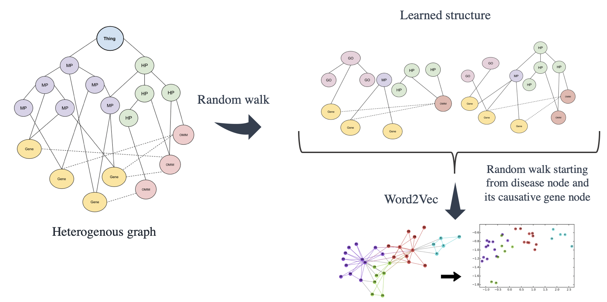

# phenoinfer_version2

## Required Libraries

python >= 3.4

## download the data from the following link into phenoifner_version2/data directory
 
let your current directory in phenoinfer_version2/data
 

https://drive.google.com/open?id=1w5Shb8zNGv0E-vYurNEKWzAUoMrkHN9e
you may need to download the data and store it in the root directory

## preprocess the data
## there are 5 different types of data: union, intersection, go, mp, uberon
let us have union as example for the following operation
then execute

    sh data_preprocessing.sh

## move your current directory to /GraphSAGE/graphsage
    python random_rank_predict_inner_product.py union

## the main embedding learning process

    

